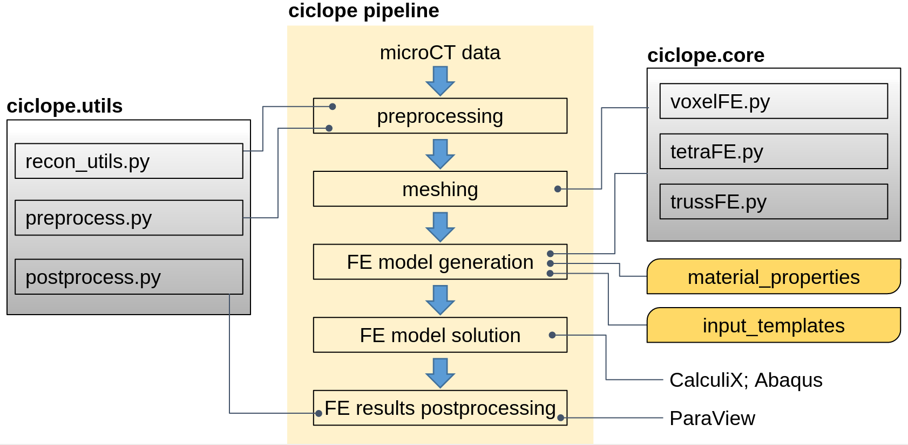

# Summary
The Python package `ciclope` processes micro computed tomography images to generate finite element models. 
`Ciclope` is aimed to provide a reproducible fully open-source pipelines for simulating the mechanical behaviour of trabecular bone using Finite Element models.

# Statement of need
Micro Finite Element (microFE) models derived from micro Computed Tomography (microCT) volumetric data can provide non-destructive assessments of mechanical properties of trabecular bone. The technique is used to investigate the effect of pathologies, treatment and remodelling on the mechanical response of bone at the tissue level, and is applied both to human and animal samples. Linear elastic microFE simulations are implemented to back-calculate the tissue elastic modulus [@bayraktar_comparison_2004], understand deformation mechanisms [@zauel_comparison_2005], or predict failure [@pistoia_estimation_2002] of trabecular bone, as well as to estimate the stiffness of whole bones from small animals [@oliviero_optimization_2020].

Different pipelines for the generation of microFE models of trabecular bone have been proposed [@van_lenthe_specimen-specific_2006; @verhulp_indirect_2008; @fernandez_nonlinear_2022; @megias_numerical_2022; @cox_heterogeneous_2022]. Nevertheless, the validation and comparison of results across studies is hindered by the use of proprietary or non-open-source software, and by the general absence of reproducible FE pipelines.
We present the Python package `ciclope`: a fully open-source pipeline from microCT data preprocessing to microFE model generation, solution and postprocessing.

[comment]: <> (Several groups highlighted the importance of an accurate description of boundary conditions and of validating model predictions with experimental measurements e.g. with Digital Volume Correlation.)

[comment]: <> (The development of open-source and reproducible microFE workflows is expected to facilitate and support the validation of biomechanical studies, strengthening at the same time the synergy with other fields of microFE application such as concrete, fiber composites and porous materials research.)

# Design
`Ciclope` is composed of a core library of modules for FE model generation (`ciclope.core`), and a library of utilities for image and FE model pre- and postprocessing (`ciclope.utils`) that can be imported and used within Python. Additionally, the `ciclope.py` script generated during package installation allows to launch microCT-to-FE pipelines directly from the commandline.

{width=100%}

A pipeline for the generation and solution of a FE model derived from 3D microCT data is shown in the central part of figure \autoref{fig:design}.
**Image preprocessing**: a microCT dataset is loaded as a `NumPy` `ndarray` within Python and segmented to isolate bone voxels and background. A connectivity check is performed to remove isolated cluster of voxels, that the segmentation might have disconnected from the main structure. According to the User's needs, additional image processing can be applied for smoothing, cropping, resampling and rotating the dataset using for example the `SciPy` and `scikit-image` Python libraries. Furthermore, additional layers can be added at the top and bottom surfaces should the user need to replicate the effect of endcaps in the actual mechanical testing conditions.
**Meshing**: `ciclope` allows to create several types of FE meshes. Image voxels can be directly converted to 8-node, hexahedral brick elements with the `voxelFE.py` module. Alternatively, meshes of 4-node tetrahedra can be generated calling `CGAL` [@the_cgal_project_cgal_2022] through the `tetraFE.py` module. Finally, the `beamFE.py` module allows to generate a mesh of 2-node beam elements, where each beam represents a single trabecula, and has a local trabecular thickness associated to it.
**FE model generation**: the mesh is converted to an `.INP` input file for the FE solver. Within this process, the user can define the model material properties and the type of FE analysis (i.e. boundary conditions, analysis type and steps, requested outputs) through separate `.TMP` template files. Libraries of `material_properties` and `input_templates` are provided. Additional `CalculiX` user examples and templates are available online [@noauthor_calculix_2022-1]. For voxel-FE model generation, different **material mapping** strategies can be used: uniform tissue material properties (elastic modulus and poisson ratio) can be applied to all bone voxels. Alternatively, the local image intensity (voxel grey values) can be converted to heterogeneous material properties using a mapping law defined by the user.

[comment]: <> (bone mineral density BMD through a calibration rule obtained scanning a hydroxyapatite phantom. After this, an empirical law is used to convert local BMD to tissue elastic moduli Bourne_2004; garcia_2008.)
[comment]: <> (The pipeline is composed of the following steps:)
[comment]: <> (1. **microCT image preprocessing**: after reading in python a microCT dataset, the 3D volume can be cropped and aligned according to the desired direction of load, smoothed to remove noise with a Gaussian kernel, and resampled to lower image resolution. A binary mask of the bone tissue is generated thresholding bone voxels. Several global Otsu; Ridler_1978, or local adaptive thresholding ,..., techniques have been proposed Kim 2006. Embedding layers and steel caps can be added to simulate the experimental conditions of mechanical testing.)

### The ciclope ecosystem
`Ciclope` relies on several other tools for 3D image and FE processing:

- Voxel and tetrahedra mesh exports are performed with `meshio` [@schlomer_meshio_2022].
- Tetrahedra meshes are generated with `pygalmesh`, a Python frontend to [`CGAL`](https://www.cgal.org/) [@schlomer_pygalmesh_2022].
- High-resolution surface meshes for visualization are generated with `PyMCubes` [@neila_pymcubes_2022].
- The FE input files (`.INP`) generated by `ciclope` can be solved using the free software `CalculiX` [@dhont_calculix_2022] or [`Abaqus`](https://www.3ds.com/products-services/simulia/products/abaqus/).
- For data and FE results visualization, `ciclope` relies on `itkwidgets` [@noauthor_itkwidgets_2022], `ParaView` [@noauthor_paraview_2022], and `ccx2paraview` [@noauthor_calculix_2022].

[comment]: <> (Dxchange @decarlo_2014)

# Examples
`Ciclope` contains a library of `Jupyter` notebooks of example applications in the field of computational biomechanics \autoref{fig:examples}. The main use case is a pipeline for the generation of microFE models from microCT scans of trabecular bone. The simulation (linear-elastic) of a mechanical compression test is used to back-calculate the apparent elastic modulus of trabecular bone. This procedure is demonstrated using hexahedra (voxel, \autoref{fig:examples}A), tetrahedra (\autoref{fig:examples}B), and beam finite elements (\autoref{fig:examples}C). Two approaches for the local mapping of material inhomogeneities are illustrated using voxel and tetrahedra FE. Each example can be run within `Jupyter` or executed from the commandline with the `ciclope.py` script. `Ciclope` can be applied to microCT scans other than trabecular bone, such as whole teeth (\autoref{fig:examples}D), or metal foams (\autoref{fig:examples}E).

{width=100%}

[comment]: <> (# Conclusions)

# Acknowledgements
We acknowledge support from the community for Open and Reproducible Musculoskeletal Imaging Research ([ORMIR](https://ormircommunity.github.io/index.html#)) and from Dr. Serena Bonaretti in particular.
`Ciclope` was partially developed during the Jupyter Community Workshop [“Building the Jupyter Community in Musculoskeletal Imaging Research”](https://github.com/JCMSK/2022_JCW) sponsored by [NUMFocus](https://numfocus.org/).

# References