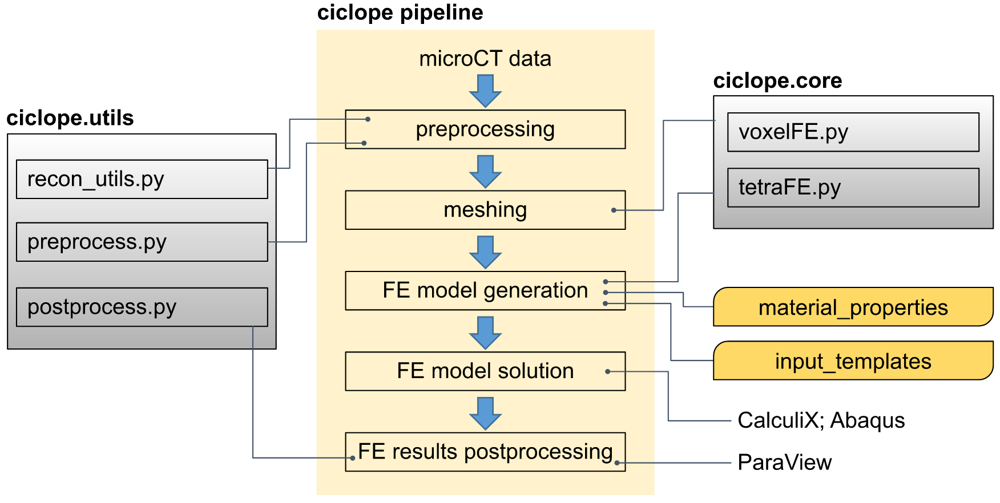

# Summary
The python package `ciclope` processes micro Computed Tomography (microCT) data to generate Finite Element (FE) models.

# Statement of need
- microCT to finite elements pipelines are used to..
- our science case is musculoskeletal imaging, but can microCT-derived FE models be applied to various fields (add examples)
- different microCT-to-microFE pipelines for trabecular bone have been proposed [@fernandez_nonlinear_2022; @megias_numerical_2022; @cox_heterogeneous_2022], none of which is fully open-source. As a result validation and comparison of results remains challenging.
- We present a fully-open-source pipeline from microCT data preprocessing to FE model generation, solution and postprocessing (visualization) of results.

# Design
A typical pipeline for FE model generation from 3D microCT data is shown in figure \autoref{fig:design}.

The package is composed of a core module containing methods for FE model generation (`ciclope.core`), and a module of utilities for image and FE model pre- and post-processing (`ciclope.utils` ).

Figure sizes can be customized by adding an optional second parameter:
{ width=20% }

## Usage
Both modules can be imported and used within Python.
Pipelines of FE model generation can be launched from the commandline using the `ciclope.py` script generated during installation. See the section [usage](usage) for more details.

# Examples
description of examples..

# Conclusions
If you want to cite a software repository URL (e.g. something on GitHub without a preferred
citation) then you can do it with the example BibTeX entry below for @fidgit.

For a quick reference, the following citation commands can be used:
- `@author:2001`  ->  "Author et al. (2001)"
- `[@author:2001]` -> "(Author et al., 2001)"
- `[@author1:2001; @author2:2001]` -> "(Author1 et al., 2001; Author2 et al., 2002)"

# Acknowledgements

We acknowledge contributions from , and support from .. during the genesis of this project.

# References