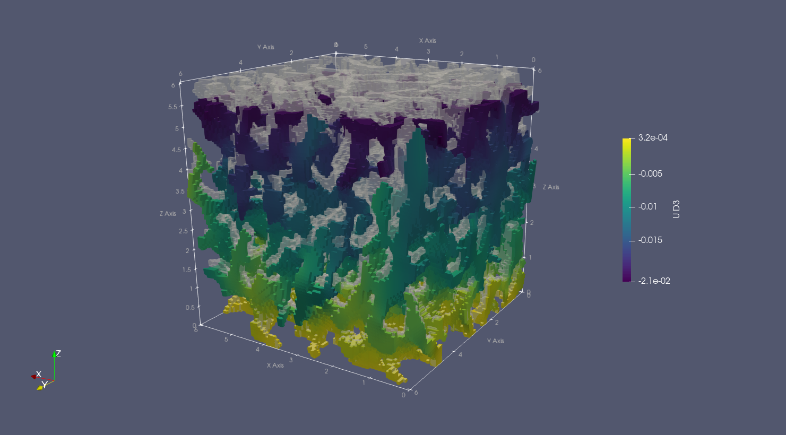
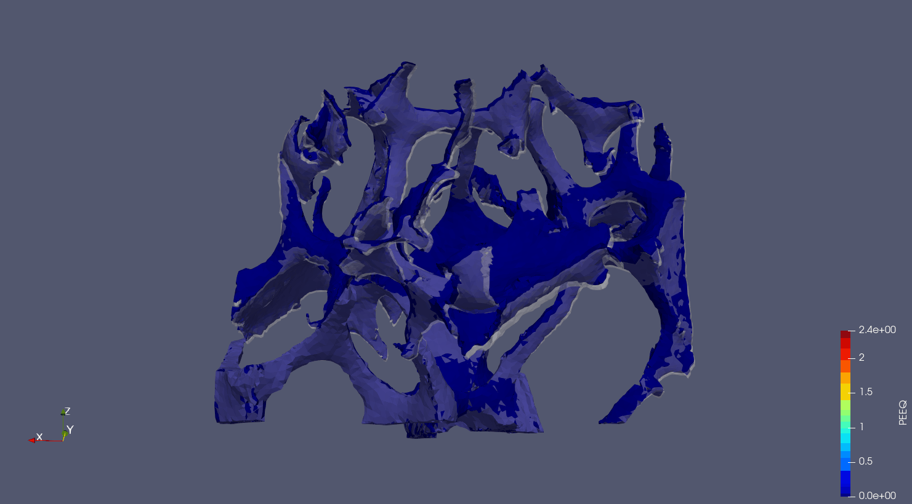

# ciclope
Computed Tomography to Finite Elements.

**ciclope** processes micro Computed Tomography (microCT) data to generate Finite Element (FE) models. <br />
**ciclope** can be run from the command line as a script. To view the help type
```
python ciclope/ciclope.py -h
```

To use **ciclope** within python, import the module with
```
from ciclope import ciclope
```

The following table shows a general pipeline for FE model generation from CT data that can be executed with ciclope:

| # | Step | Description | **ciclope** flag |
|:-:|:-|:-|:-|
| 1. | **Load CT data** | | |
| 2. | **Pre-processing** | Gaussian smooth | `--smooth` |
| | | Resize image | `-r` |
| | | Add embedding | (not implemented yet) |
| | | Add caps | `--caps` |
| 3. | **Segmentation** | Uses Otsu method if left empty | `-t` |
| | | Remove unconnected voxels | |
| 4. | **Meshing** | Outer shell mesh of triangles | `--shell_mesh` |
| | | Volume mesh of tetrahedra | `--vol_mesh` |
| 5. | **FE model generation** | Apply Boundary Conditions | |
| | | Material mapping | `-m`, `--mapping` |
| | | Voxel FE | `--voxelfe` |
| | | Tetrahedra FE | `--tetrafe` |

---
### Notes on ciclope
* Tetrahedra meshes are generated with [pygalmesh](https://github.com/nschloe/pygalmesh) (a Python frontend to [CGAL](https://www.cgal.org/))
* High-resolution surface meshes for visualization are generated with the [PyMCubes](https://github.com/pmneila/PyMCubes) module.
* All mesh exports are performed with the [meshio](https://github.com/nschloe/meshio) module.
* **ciclope** handles the definition of material properties and FE analysis parameters (e.g. boundary conditions, simulation steps..) through separate template files. The folders [material_properties](/material_properties) and [input_templates](/input_templates) contain a library of template files that can be used to generate FE simulations.
  * Additional libraries of [CalculiX](https://github.com/calculix) examples and template files can be found [here](https://github.com/calculix/examples) and [here](https://github.com/calculix/mkraska)
___

### ciclope examples:
#### [example 1: voxel-FE model of trabecular bone](ciclope/ciclope_ex01_voxelFE_trabecularbone_CalculiX.ipynb)
[](https://jupyter.org/try)


- [x] Load and inspect microCT volume data
- [x] Apply Gaussian smooth
- [x] Resample the dataset
- [x] Segment the bone tissue
- [x] Remove unconnected clusters of voxels
- [x] Convert the 3D binary to a voxel-FE model for simulation in CalculX or Abaqus
  - [x] Linear, static analysis; displacement-driven
  - [ ] Local material mapping (dataset grey values to bone material properties)
- [x] Launch simulation in Calculix
- [x] Convert Calculix output to .VTK for visualization in Paraview
- [x] Visualize simulation results in Paraview

#### [example 2: tetrahedra-FE model of stainless steel foam](ciclope/ciclope_ex02_tetraFE_steelfoam_CalculiX.ipynb)

- [x] Load and inspect synchrotron microCT volume data
- [x] Apply Gaussian smooth
- [x] Resample the dataset
- [x] Segment the steel
- [x] Remove unconnected clusters of voxels
- [x] Generate volume mesh of tetrahedra
- [x] Generate high-resolution mesh of triangles of the model outer shell (for visualization)
- [x] Convert the 3D binary to a tetrahedra-FE model for simulation in CalculX or Abaqus
  - [x] Non-linear, quasi-static analysis definition: tensile test with material plasticity. For more info visit: [github.com/mkraska/CalculiX-Examples](https://github.com/mkraska/CalculiX-Examples/blob/master/Drahtbiegen/Zug/Zug.inp)
  - [ ] Local material mapping
- [x] Launch simulation in Calculix
- [x] Convert Calculix output to .VTK for visualization in Paraview
- [x] Visualize simulation results in Paraview
 
___
### 2 DO:
- [ ] PACKAGING!

#### Documentation
- [X] link to [CalculiX examples](https://github.com/calculix/examples/tree/master/materials)
- [X] clean example notebooks
- [ ] add picture of CT 2 FE `ciclope.main()` pipeline:
  1. load data
  2. pre-processing
     1. gauss_smooth
     2. imresize
     3. add embedding
     4. add caps
  3. segmentation
     1. Otsu threshold
     2. remove_unconnected
  4. (meshing) (voxel; tetra)
  5. voxel-FE model generation
     1. apply BCs
     2. material mapping
  6. solve CalculiX
  7. post-processing (F-u curve)
- [ ] list of features
- [ ] ciclope usage examples
  - [ ] as a script
  - [ ] as a module - ciclope.methods
    - [ ] `cgal_mesh`
    - [ ] `shell_mesh`
    - [ ] `vol2voxelfe`
    - [ ] `mesh2tetrafe`

#### Pre-processing
- [x] add caps
- [X] write midplanes images (.PNG)
- [ ] 3D dataset embedding

#### pybonemorph
- [X] Center Of Mass
- [X] periosteum mask
- [ ] endosteum contour
- [ ] cortical bone mask

#### Post-processing
- [ ] CalculiX postprocessing
  - [X] process CalculiX output with [`dat2txt.py`](https://github.com/mkraska/CalculiX-Examples/tree/master/Scripts)
  - [X] produce Force displacement plot with `pandas`
  - [ ] convergence plots with [`monitor.py`](https://github.com/mkraska/CalculiX-Examples/tree/master/Scripts)

#### Examples
- [X] CalculiX postprocessing
- [ ] steel caps
- [ ] embedding
- [ ] material property mapping with voxel-FE
- [ ] material property mapping with tetra-FE
- [ ] pipeline automation
  - [ ] launch from and write results to master table
  - [ ] multiple load configurations (comp, tens, shear, torsion, bending)
- [ ] multi-material tetrahedra-FE


