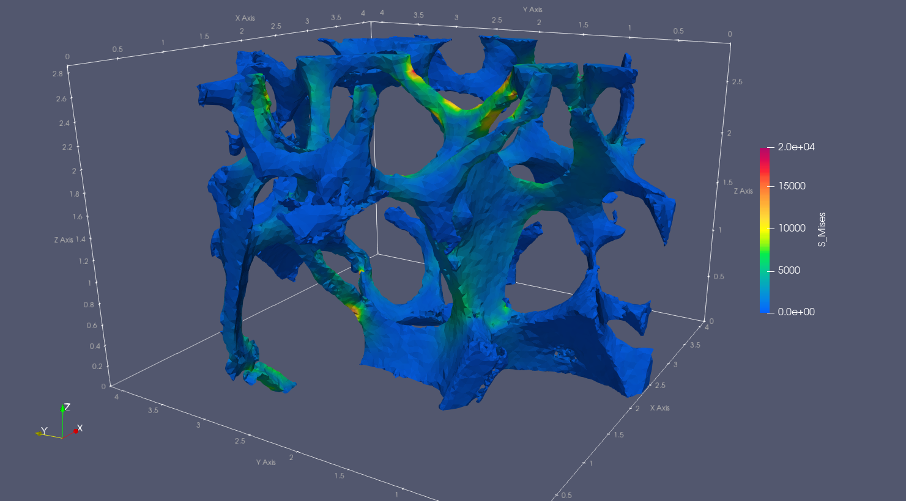

# ciclope
Computed Tomography to Finite Elements.

ciclope processes micro Computed Tomography (microCT) data to generate Finite Element (FE) models. <br />
ciclope can be run from the command line as a script. To view the help type
```
python ciclope.py -h
```

To use ciclope within python, import the module with
```
import ciclope
```
---
### Notes on ciclope
* All mesh exports are performed with the [meshio](https://github.com/nschloe/meshio/blob/master/meshio/abaqus/_abaqus.py) and [pygalmesh](https://github.com/nschloe/pygalmesh) modules
* ciclope handles the definition of material properties and FE analysis parameters (e.g. boundary conditions, simulation steps..) through separate template files. The folders [material_properties](/material_properties) and [input_templates](/input_templates) contain a library of template files that can be used to generate FE simulations.

___

### Examples:
#### [example 1: voxel-FE model of trabecular bone](src/ciclope/ciclope_ex01_voxelFE_trabecularbone_CalculiX.ipynb)

- [x] Load and inspect microCT volume data
- [x] Apply Gaussian smooth
- [x] Resample the dataset
- [x] Segment the bone tissue
- [x] Remove unconnected clusters of voxels
- [x] Convert the 3D binary to a voxel-FE model for simulation in CalculX or Abaqus
  - [x] Linear, static analysis; displacement-driven
  - [ ] Local mapping of the dataset grey values to bone material properties
- [x] Launch simulation in Calculix
- [x] Convert Calculix output to .VTK for visualization in Paraview
- [x] Visualize simulation results in Paraview

#### [example 2: tetrahedra-FE model of stainless steel foam](src/ciclope/ciclope_ex02_tetraFE_steelfoam_CalculiX.ipynb)

- [x] Load and inspect synchrotron microCT volume data
- [x] Apply Gaussian smooth
- [x] Resample the dataset
- [x] Segment the steel
- [x] Remove unconnected clusters of voxels
- [x] Generate volume mesh of tetrahedra
- [ ] Generate high-resolution mesh of triangles of the model outer shell (for visualization)
- [x] Convert the 3D binary to a tetrahedra-FE model for simulation in CalculX or Abaqus
  - [x] Non-linear, quasi-static analysis definition: tensile test with material plasticity. For more info visit: [github.com/mkraska/CalculiX-Examples](https://github.com/mkraska/CalculiX-Examples/blob/master/Drahtbiegen/Zug/Zug.inp)
  - [ ] Local mapping of the dataset grey values to bone material properties
- [x] Launch simulation in Calculix
- [x] Convert Calculix output to .VTK for visualization in Paraview
- [x] Visualize simulation results in Paraview
 
___
### 2 DO:
- [ ] PACKAGING!!!

#### Documentation
- [ ] link to [CalculiX examples](https://github.com/calculix/examples/tree/master/materials)
- [ ] illustrate typical pipeline(s)
- [ ] ciclope usage
  - [ ] as a script
  - [ ] as a module - ciclope.methods

#### Pre-processing
- [x] add caps
- [X] write midplanes images (.PNG)
- [ ] 3D dataset embedding

#### pybonemorph
- [X] Center Of Mass
- [X] periosteum mask
- [ ] endosteum contour
- [ ] cortex mask

#### Post-processing
- [ ] CalculiX postprocessing
  - [X] process CalculiX output with [`dat2txt.py`](https://github.com/mkraska/CalculiX-Examples/tree/master/Scripts)
  - [X] produce Force displacement plot with `pandas`
  - [ ] convergence plots with [`monitor.py`](https://github.com/mkraska/CalculiX-Examples/tree/master/Scripts)

#### Examples
- [X] CalculiX postprocessing
- [ ] steel caps
- [ ] embedding
- [ ] matprop calibrate (voxelFE)
- [ ] tetraFE with different materials


