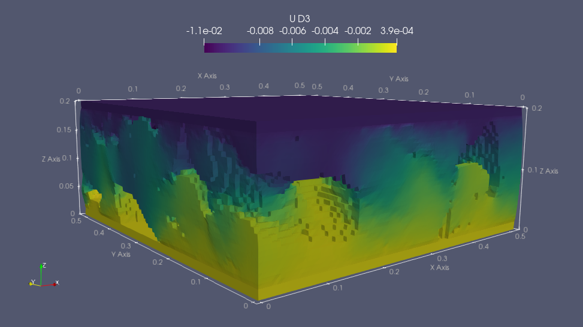
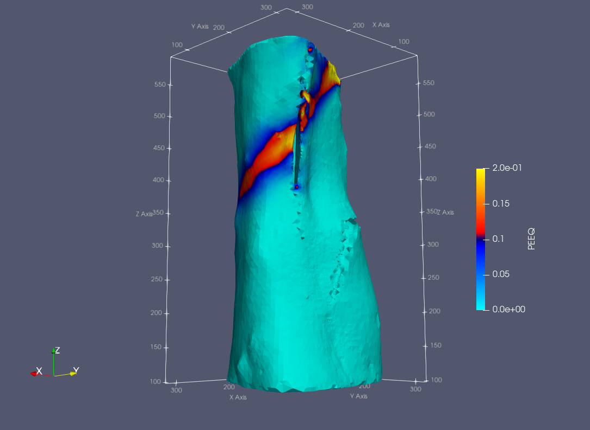

# CT2FE
#### (Computed Tomography to Finite Elements)

Utilities, scripts and notebooks for the conversion of synchrotron computed tomography data to finite element models.  
The folder [test_data](test_data) contains a test dataset for stress/displacement analysis.  
For further CalculiX examples visit [github.com/mkraska/CalculiX-Examples](https://github.com/mkraska/CalculiX-Examples)  

___

### Jupyter notebooks containing CT2FE examples:
- [CT2FE_example01_voxelFE_static_CalculiX.ipynb](CT2FE_example01_voxelFE_static_CalculiX.ipynb)

    - [x] Load, inspect and write a 3D CT dataset
    - [x] Convert 3D stack to voxel-FE model for simulation in CalculX or Abaqus
        - [x] Local mapping of the dataset grey values to bone material properties
    - [x] Run simulation in Calculix
    - [x] Convert Calculix output to .VTK for visualization in Paraview
    - [x] Visualize simulation results in Paraview

- [CT2FE_example03_voxelFE_linear_CalculiX.ipynb](CT2FE_example03_voxelFE_linear_CalculiX.ipynb)
      Same test as example01 but with constant material properties assigned to the bone tissue

- [CT2FE_example02_Slicer3Dmesher_Nlgeom_CalculiX.ipynb](tmp.ipynb)

    - [x] Load unstructured grid mesh preprocessed and generated with [3D Slicer](https://www.slicer.org/)  
    Follow tutorial for mesh generation in 3D Slicer using the -> [SlicerSegmentMesher module](https://github.com/lassoan/SlicerSegmentMesher#tutorial) 
    - [x] Read and modify mesh including:
        - [x] Material property definition
        - [x] Non-linear, quasi-static analysis definition: tensile test with material plasticity. Visit also [github.com/mkraska/CalculiX-Examples](https://github.com/mkraska/CalculiX-Examples/blob/master/Drahtbiegen/Zug/Zug.inp)
        - [x] Definition of boundary conditions
    - [x] Export mesh using the [meshio module](https://github.com/nschloe/meshio/blob/master/meshio/abaqus/_abaqus.py)
    - [x] Run simulation in Calculix
    - [x] Convert Calculix output to .VTK for visualization in Paraview
    - [x] Visualize simulation results in Paraview
___
### 2 DO:
**Pre-processing:**
- [x] add steel caps to the model
- [ ] 3D dataset embedding
- [ ] real BMD calibration 2 material properties example
- [X] write midplanes images (.PNG)

**FE generation scripts:**
- [X] write shell mesh
- [X] write volume mesh
- [X] GV-based material property mapping
- [ ] CT2FE general script
    - [ ] imresize
    - [ ] 3D gaussian filter
    - [ ] add caps
    - [ ] binarize
    - [ ] voxel FE (FLAG)
    - [ ] tetrahedra FE (FLAG)
    - [ ] const material property
    - [ ] material property mapping (FLAG)
    - [ ] beam FE
    - [ ] input mat prop and analysis template as separate .INP files
    
- [ ] create module library (?)

**Other:**
- [ ] CalculiX postprocessing example
- [x] linear elastic analysis
- [x] non-linear analysis (Nlgeom)
- [ ] bone failure analysis (bone damage with Pistoia model?)
- [x] Calculix parallel (ccx_MT)
- [x] output different file format (.VTK)
- [ ] documentation pages (sphinx?)

