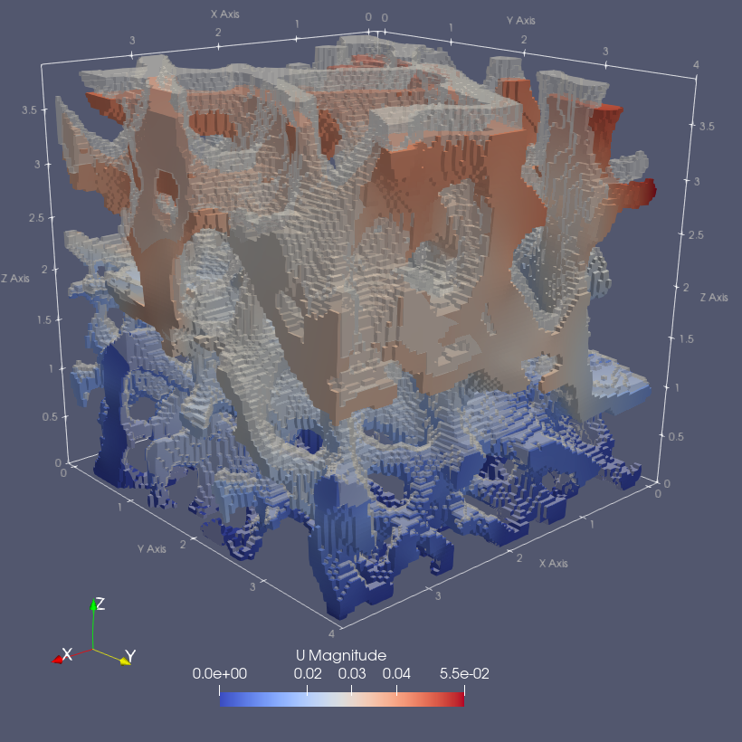

# ciclope
Computed Tomography to Finite Elements.

[](https://github.com/Naereen/StrapDown.js/blob/master/LICENSE)

[](https://pypi.org/project/ciclope/1.1.0/)
[](https://pypi.org/project/ciclope/1.1.0/)

**ciclope** processes micro Computed Tomography (microCT) data to generate Finite Element (FE) models. <br />

---
### Installation
Install using pip. The flag `[all]` will install optional dependencies needed to run full pipelines and examples.
For development installation see the [development guide](development.md).
```commandline
pip install ciclope[all]
```
---
### Usage
**ciclope** pipelines can be run from the command line as a script. Scroll down and take a look at the [Examples](###Examples) folder for this type of use.
To view the command line script help run:
```commandline
ciclope -h
```

To use **ciclope** within python, import the package with
```python
import ciclope
```
#### Image pre-processing
`ciclope.utils` contain functions that help you read and pre-process a 3D image for FE model generation. You can skip this and use `ciclope` with 3D data as [`numpy.ndarray`](https://numpy.org/doc/stable/reference/generated/numpy.ndarray.html), or directly with a 3D [`meshio`](https://github.com/nschloe/meshio) object.

Read 3D CT dataset stored as stack of TIFFs:
```python
from ciclope.utils.recon_utils import read_tiff_stack

input_file = '/path_to_your_file/slice_0000.tiff'

data_3D = read_tiff_stack(input_file)
vs = np.ones(3) * 0.06  # voxelsize [mm]
```
Segment and remove unconnected voxels:
```python
from skimage import morphology
from ciclope.utils.pybonemorph import remove_unconnected

BW = data_3D > 142 # fixed global threshold
BW = morphology.closing(BW, morphology.ball(2)) # optional step
L = remove_unconnected(BW)
```
The image is now ready for FE model generation.

#### voxel-FE

Generate **voxel-FE** model of linear elastic compression test:
```python
import ciclope

input_template = "./input_templates/tmp_example01_comp_static_bone.inp"

# generate unstructured grid mesh
mesh = ciclope.voxelFE.vol2ugrid(data_3D, vs)

# generate CalculiX input file
ciclope.voxelFE.mesh2voxelfe(mesh, input_template, 'foo.inp', keywords=['NSET', 'ELSET'])
```

#### tetrahedra-FE

Generate mesh of tetrahedra. `ciclope` uses [`pygalmesh`](https://github.com/nschloe/pygalmesh) for tetrahedra mesh generation:
```python
mesh = ciclope.tetraFE.cgal_mesh(L, vs, 'tetra', max_facet_distance=0.2, max_cell_circumradius=0.1)
```

Generate **tetrahedra-FE** model of non-linear tensile test
```python
input_template = "./input_templates/tmp_example02_tens_static_steel.inp"

# generate CalculiX input file
ciclope.tetraFE.mesh2tetrafe(mesh, input_template, 'foo.inp', keywords=['NSET', 'ELSET'])
```
---
### ciclope pipeline 
The following table shows a general pipeline for FE model generation from CT data that can be executed with ciclope:

| # | Step | Description | **ciclope** flag |
|:-:|:-|:-|:-|
| 1. | **Load CT data** | | |
| 2. | **Pre-processing** | Gaussian smooth | `--smooth` |
| | | Resize image | `-r` |
| | | Add embedding | (not implemented yet) |
| | | Add caps | `--caps` |
| 3. | **Segmentation** | Uses Otsu method if left empty | `-t` |
| | | Remove unconnected voxels | |
| 4. | **Meshing** | Outer shell mesh of triangles | `--shell_mesh` |
| | | Volume mesh of tetrahedra | `--vol_mesh` |
| 5. | **FE model generation** | Apply Boundary Conditions | |
| | | Material mapping | `-m`, `--mapping` |
| | | Voxel FE | `--voxelfe` |
| | | Tetrahedra FE | `--tetrafe` |

---
### Notes on ciclope
* Tetrahedra meshes are generated with [pygalmesh](https://github.com/nschloe/pygalmesh) (a Python frontend to [CGAL](https://www.cgal.org/))
* High-resolution surface meshes for visualization are generated with the [PyMCubes](https://github.com/pmneila/PyMCubes) module.
* All mesh exports are performed with the [meshio](https://github.com/nschloe/meshio) module.
* **ciclope** handles the definition of material properties and FE analysis parameters (e.g. boundary conditions, simulation steps..) through separate template files. The folders [material_properties](/material_properties) and [input_templates](/input_templates) contain a library of template files that can be used to generate FE simulations.
  * Additional libraries of [CalculiX](https://github.com/calculix) examples and template files can be found [here](https://github.com/calculix/examples) and [here](https://github.com/calculix/mkraska)
___

### Examples
#### [Example 1: voxel-uFE model of trabecular bone; linear compression test](examples/ciclope_ex01_voxeluFE_CalculiX.ipynb) [](examples/old/ciclope_ex01_voxelFE_trabecularbone_CalculiX.ipynb)


The pipeline can be executed from the command line with:
```commandline
ciclope test_data/LHDL/3155_D_4_bc/cropped/3155_D_4_bc_0000.tif test_data/LHDL/3155_D_4_bc/results/3155_D_4_bc_voxelFE.inp -vs 0.0195 0.0195 0.0195 -r 2 -t 63 --smooth 1 --voxelfe --template input_templates/tmp_example01_comp_static_bone.inp --verbose
```

The example shows how to:
- [x] Load and inspect microCT volume data
- [x] Apply Gaussian smooth
- [x] Resample the dataset
- [x] Segment the bone tissue
- [x] Remove unconnected clusters of voxels
- [x] Convert the 3D binary to a voxel-FE model for simulation in CalculX or Abaqus
  - [x] Linear, static analysis; displacement-driven
  - [ ] Local material mapping (dataset grey values to bone material properties)
- [x] Launch simulation in Calculix
- [x] Convert Calculix output to .VTK for visualization in Paraview
- [x] Visualize simulation results in Paraview

#### [Example 2: tetrahedra-uFE model of trabecular bone; linear compression test](examples/ciclope_ex04_tetraFE_steelfoam_nonlinear_CalculiX.ipynb) [](examples/ciclope_ex02_tetrauFE_CalculiX.ipynb)


The pipeline can be executed from the command line with:
```commandline
ciclope test_data/LHDL/3155_D_4_bc/cropped/3155_D_4_bc_0000.tif test_data/LHDL/3155_D_4_bc/results/3155_D_4_bc.inp -vs 0.0195 0.0195 0.0195 -r 2 -t 63 --smooth 1 --tetrafe --max_facet_distance 0.025 --max_cell_circumradius 0.05 --vol_mesh --template input_templates/tmp_example01_comp_static_bone.inp
```

#### [Example #4 - non-linear tetrahedra-FE model of stainless steel foam](examples/ciclope_ex04_tetraFE_steelfoam_nonlinear_CalculiX.ipynb) [](examples/ciclope_ex02_tetraFE_steelfoam_CalculiX.ipynb)


The pipeline can be executed from the command line with:
```commandline
ciclope input.tif output.inp -vs 0.0065 0.0065 0.0065 --smooth -r 1.2 -t 90 --vol_mesh --tetrafe --template ./../input_templates/tmp_example02_tens_Nlgeom_steel.inp -v
```

The example shows how to:
- [x] Load and inspect synchrotron microCT volume data
- [x] Apply Gaussian smooth
- [x] Resample the dataset
- [x] Segment the steel
- [x] Remove unconnected clusters of voxels
- [x] Generate volume mesh of tetrahedra
- [x] Generate high-resolution mesh of triangles of the model outer shell (for visualization)
- [x] Convert the 3D binary to a tetrahedra-FE model for simulation in CalculX or Abaqus
  - [x] Non-linear, quasi-static analysis definition: tensile test with material plasticity. For more info visit: [github.com/mkraska/CalculiX-Examples](https://github.com/mkraska/CalculiX-Examples/blob/master/Drahtbiegen/Zug/Zug.inp)
  - [ ] Local material mapping
- [x] Launch simulation in Calculix
- [x] Convert Calculix output to .VTK for visualization in Paraview
- [x] Visualize simulation results in Paraview

