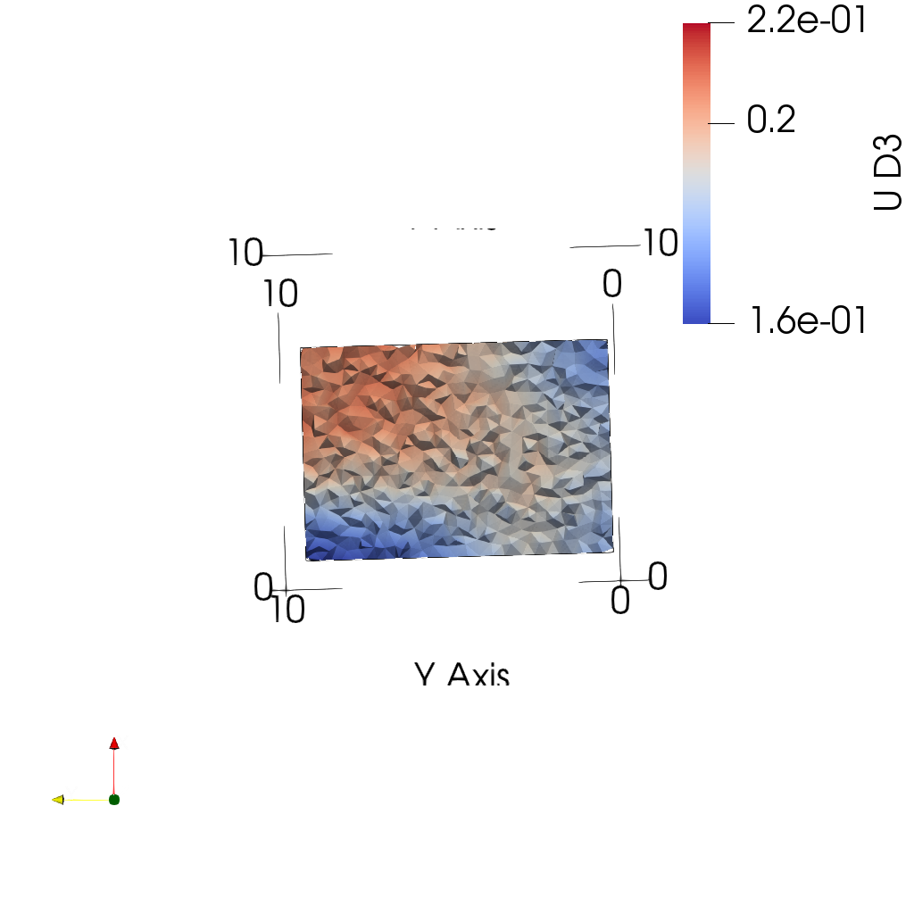
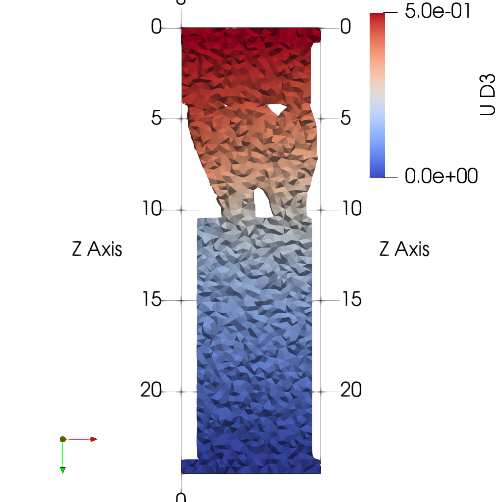
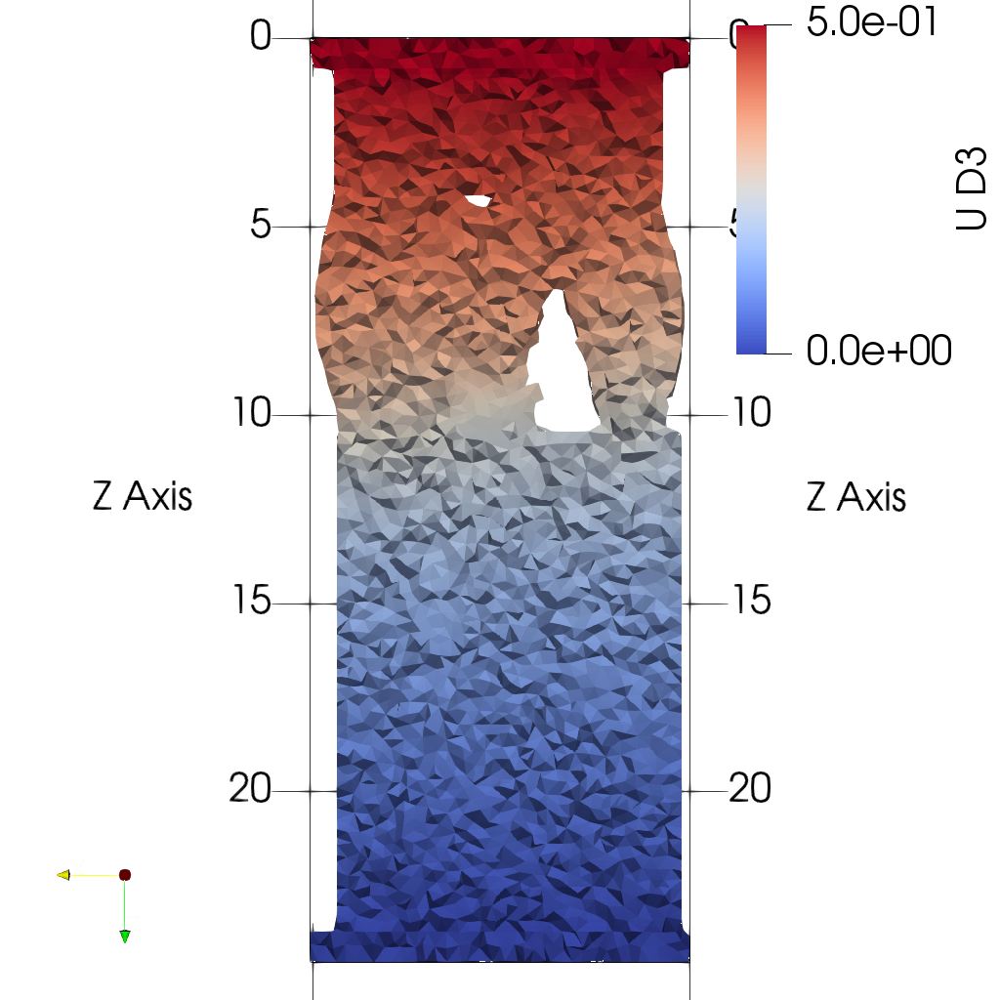
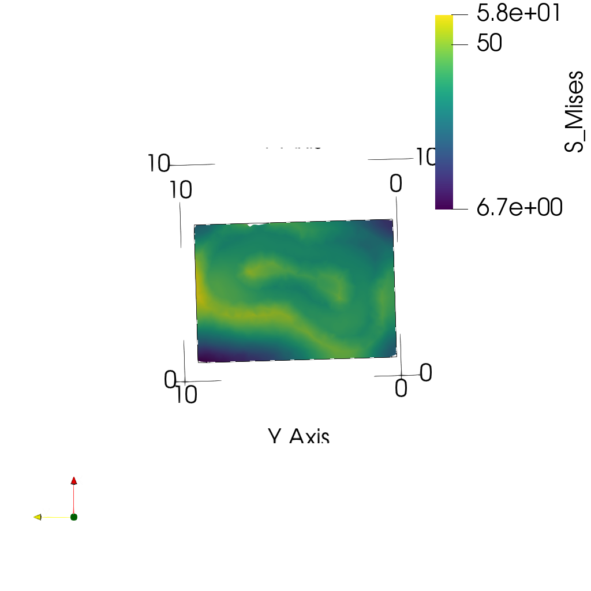
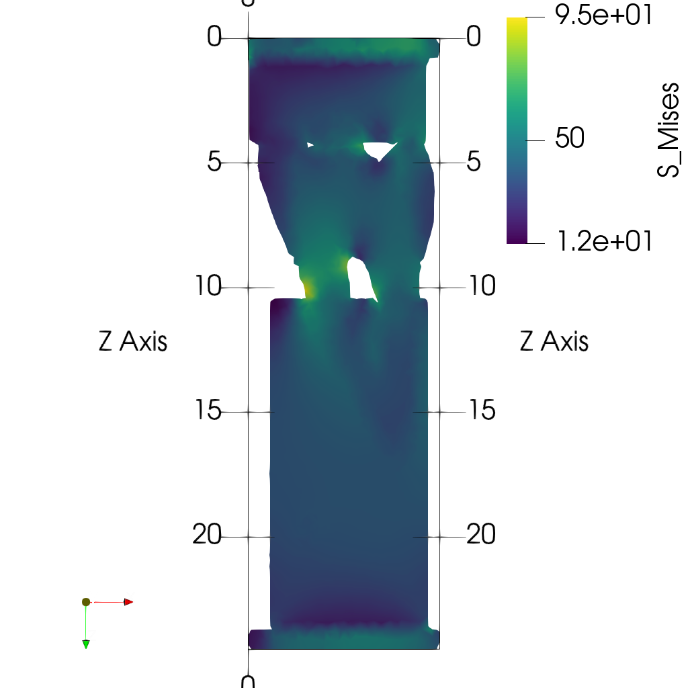
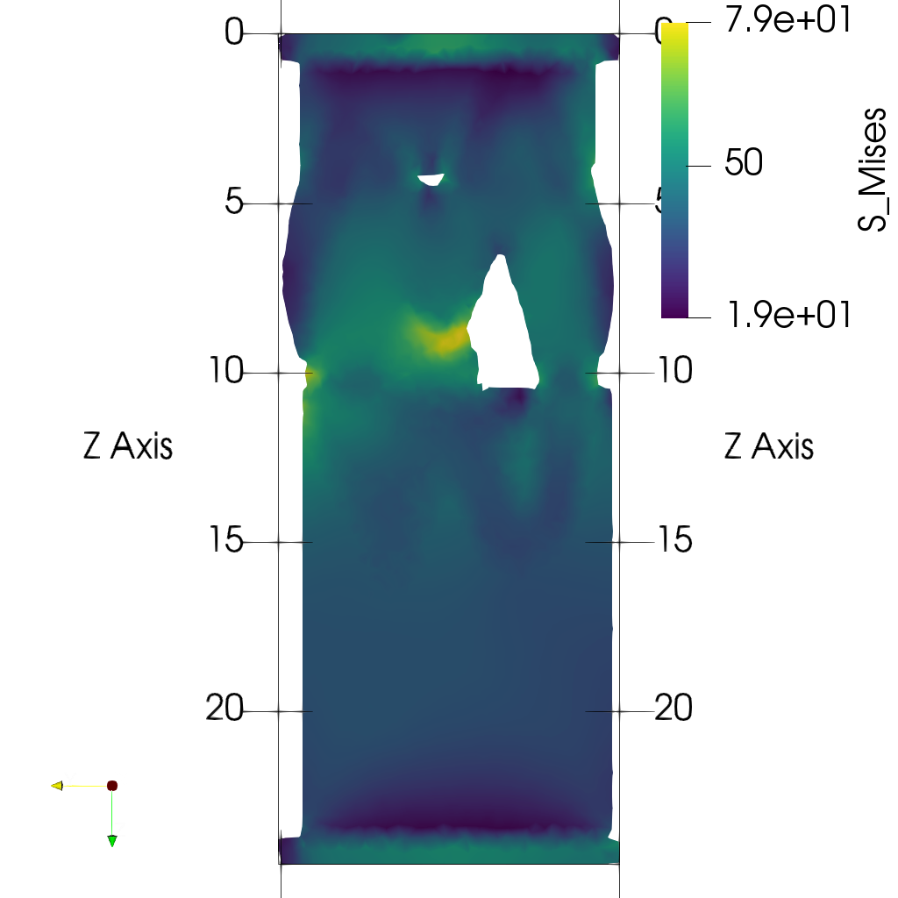

# Usage
A general pipeline for FE model generation from microCT data is composed of the following steps:


To use **ciclope** within python, import the package with
```python
import ciclope
```
---
## Image pre-processing
`ciclope.utils` contains functions that help you read and pre-process 3D datasets for FE model generation. You can skip this and use `ciclope` with 3D data as [`numpy.ndarray`](https://numpy.org/doc/stable/reference/generated/numpy.ndarray.html), or directly with a 3D [`meshio`](https://github.com/nschloe/meshio) mesh object.

Read 3D CT dataset stored as stack of TIFFs:
```python
from ciclope.utils.recon_utils import read_tiff_stack

input_file = '/path_to_your_file/slice_0000.tiff'

data_3D = read_tiff_stack(input_file)
vs = np.ones(3) * 0.06  # voxelsize [mm]
```
Segment the 3D image and remove unconnected voxels:
```python
from skimage import morphology
from ciclope.utils.preprocess import remove_unconnected

BW = data_3D > 142 # fixed global threshold
BW = morphology.closing(BW, morphology.ball(2)) # optional step
L = remove_unconnected(BW)
```
---
## FE model generation
### voxel-FE

Generate **voxel-FE** model of linear elastic compression test:
```python
import ciclope

input_template = "./input_templates/tmp_example01_comp_static_bone.inp"

# generate unstructured grid mesh
mesh = ciclope.voxelFE.vol2ugrid(data_3D, vs)

# generate CalculiX input file
ciclope.voxelFE.mesh2voxelfe(mesh, input_template, 'foo.inp', keywords=['NSET', 'ELSET'])
```

### tetrahedra-FE

Generate mesh of tetrahedra. `ciclope` uses [`pygalmesh`](https://github.com/nschloe/pygalmesh) for tetrahedra mesh generation:
```python
mesh = ciclope.tetraFE.cgal_mesh(L, vs, 'tetra', max_facet_distance=0.2, max_cell_circumradius=0.1)
```

Generate **tetrahedra-FE** model of non-linear tensile test
```python
input_template = "./input_templates/tmp_example02_tens_static_steel.inp"

# generate CalculiX input file
ciclope.tetraFE.mesh2tetrafe(mesh, input_template, 'foo.inp', keywords=['NSET', 'ELSET'])
```
---
## Post-processing of results
`ciclope.utils.postprocess.paraviewplot` calls [ParaView](https://www.paraview.org/) to generate and save plots of a chosen model scalar field:

- Add path to your ParaView installation with
```python
import sys
sys.path.append('~/Applications/ParaView-5.9.0-RC1-MPI-Linux-Python3.8-64bit/lib/python3.8/site-packages')
```

- Plot midplanes of the vertical displacement field `UD3`:
```python
ciclope.utils.postprocess.paraview_plot('test_data/tooth/results/Tooth_3_scaled_2.vtk', slicenormal="xyz",
                                        RepresentationType="Surface", Crinkle=True, ColorBy=['U', 'D2'], Roll=90,
                                        ImageResolution=[1024, 1024], TransparentBackground=True,
                                        colormap='Cool to Warm')
```
| | | |
|:-------------------------:|:-------------------------:|:-------------------------:|
| |  |  |

- Plot midplanes of the Von Mises stress `S_Mises`:
```python
ciclope.utils.postprocess.paraview_plot("test_data/tooth/results/Tooth_3_scaled_2.vtk", slicenormal="xyz",
                                        RepresentationType="Surface", Crinkle=False, ColorBy="S_Mises", Roll=90,
                                        ImageResolution=[1024, 1024])
```
| | | |
|:-------------------------:|:-------------------------:|:-------------------------:|
| |  |  |

---
## command-line use
**ciclope** pipelines can be run from the command line as a script. Scroll down and take a look at the [Examples](###Examples) for this type of use.
To view the command line script help run:
```shell
ciclope -h
```

The following table shows a general pipeline for FE model generation from CT data that can be executed with ciclope:

| # | Step | Description | **ciclope** flag |
|:-:|:-|:-|:-|
| 1. | **Load CT data** | | |
| 2. | **Pre-processing** | Gaussian smooth | `--smooth` |
| | | Resize image | `-r` |
| | | Add embedding | (not implemented yet) |
| | | Add caps | `--caps` |
| 3. | **Segmentation** | Uses Otsu method if left empty | `-t` |
| | | Remove unconnected voxels | |
| 4. | **Meshing** | Outer shell mesh of triangles | `--shell_mesh` |
| | | Volume mesh of tetrahedra | `--vol_mesh` |
| 5. | **FE model generation** | Apply Boundary Conditions | |
| | | Material mapping | `-m`, `--mapping` |
| | | Voxel FE | `--voxelfe` |
| | | Tetrahedra FE | `--tetrafe` |